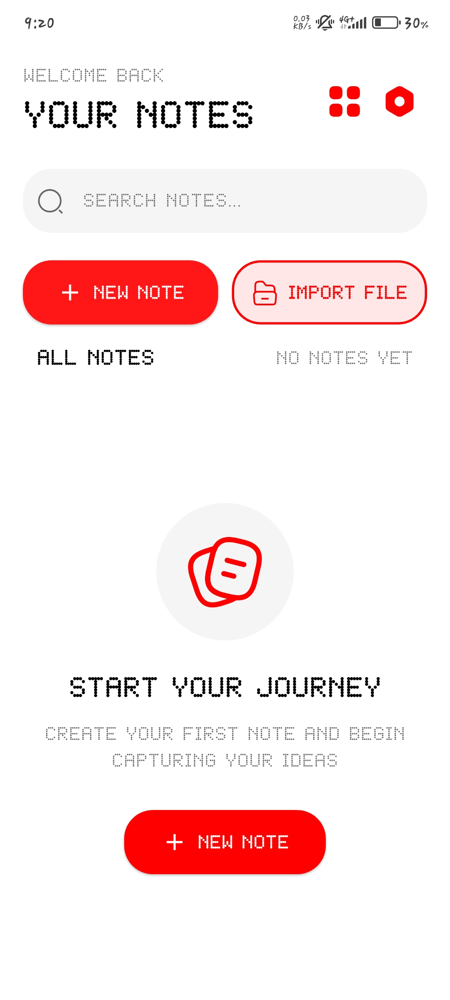
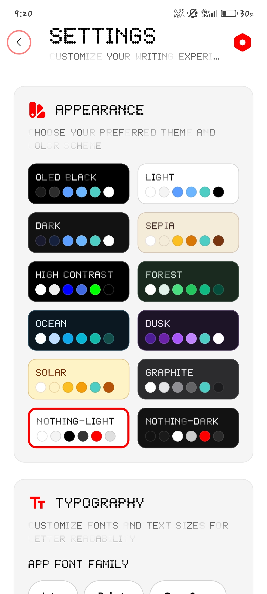
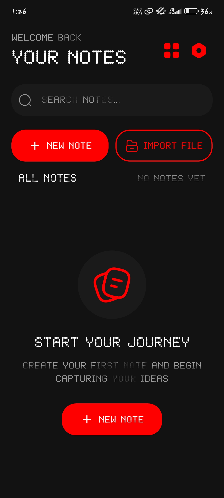
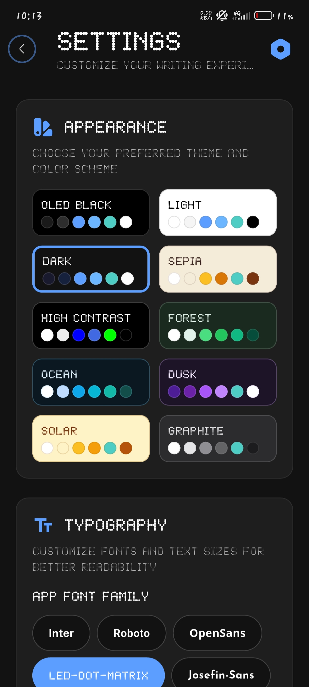
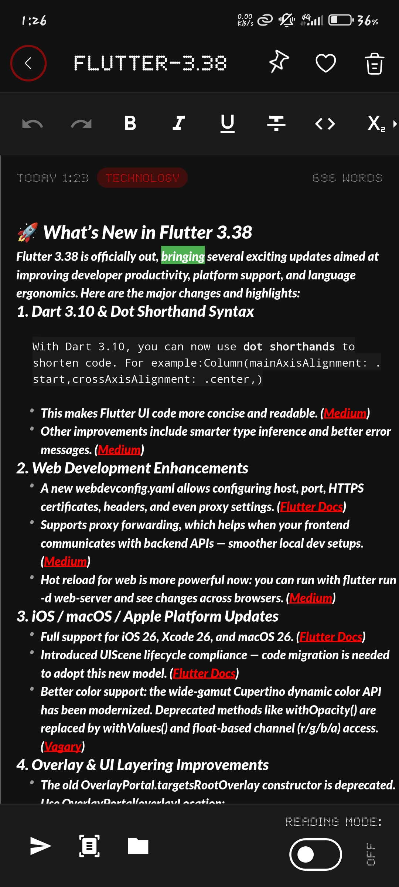

# 📝 Notes App

A beautiful and feature-rich minimalist note-taking application built with Flutter. This app combines powerful functionality with an elegant, user-friendly interface to help you capture, organize, and manage your thoughts efficiently.

## ✨ Features

### Core Features
- **Rich Text Editor**: Full-featured editor powered by Flutter Quill with support for:
  - Text formatting (bold, italic, underline, strikethrough)
  - Multiple font families and sizes
  - Text colors and highlighting
  - Bulleted and numbered lists
  - Checkboxes and to-do lists
  - Block quotes and code blocks
  - Headers and alignment options

- **Media Support**: 
  - 📷 Image attachments with gallery and camera support
  - 🎙️ Audio recording and playback
  - 🖼️ Image preview with zoom and pan functionality
  - 📎 File picker integration

- **Organization**:
  - 🏷️ Color-coded notes for easy identification
  - 🔍 Powerful search functionality
  - 📋 Multiple view modes (list and grid)
  - ⭐ Pin important notes to the top
  - 🗂️ Note templates for quick creation

- **Export & Sharing**:
  - 📤 Export notes as PDF documents
  - 🔗 Share notes with other apps
  - 💾 Import/Export functionality for backup
  - 📄 PDF generation with preserved formatting

- **Customization**:
  - 🎨 Multiple theme options (OLED Black, Light themes, and more)
  - 🌓 Dark and light mode support
  - 🔤 Multiple font family options (Inter, Roboto, OpenSans, NotoSans, Nothing Font, Josefin-Sans, Raleway)
  - 🎭 Liquid glass background effects
  - 📱 Staggered grid layout for visual appeal

- **Security & Privacy**:
  - 🔒 Local authentication support (PIN/Biometric)
  - 🗄️ Local storage using SQLite
  - 🔐 Privacy-focused - all data stored locally

- **Smart Features**:
  - ⏰ Reminders and notifications
  - 📅 Timeline view for reminders
  - 🔔 Local notifications with timezone support
  - 🌐 Localization support
  - 💨 Native splash screen

## 📸 Screenshots

### Light Theme
<p align="center">
  
  
</p>

### Dark Theme
<p align="center">
  
  
  
</p>

## 🚀 Getting Started

### Prerequisites
- Flutter SDK (>=3.10.0 <4.0.0)
- Dart SDK
- Android Studio / Xcode (for mobile development)
- An IDE (VS Code, Android Studio, or IntelliJ IDEA)

### Installation

1. **Clone the repository**
   ```bash
   git clone https://github.com/yourusername/notes_app.git
   cd notes_app
   ```

2. **Install dependencies**
   ```bash
   flutter pub get
   ```

3. **Generate native splash screens**
   ```bash
   flutter pub run flutter_native_splash:create
   ```

4. **Generate launcher icons**
   ```bash
   flutter pub run flutter_launcher_icons
   ```

5. **Run the app**
   ```bash
   flutter run
   ```

## 📦 Dependencies

### State Management
- `provider` - State management solution

### Local Storage
- `sqflite` - SQLite database
- `path_provider` - Access to file system
- `shared_preferences` - Key-value storage

### UI/UX
- `iconsax_flutter` - Beautiful icon set
- `flutter_svg` - SVG support
- `flutter_staggered_grid_view` - Staggered grid layouts
- `figma_squircle` - Smooth rounded corners
- `toastification` - Modern toast notifications

### Rich Text
- `flutter_quill` - Rich text editor
- `flutter_quill_extensions` - Extensions for Quill
- `flutter_localization` - Localization support

### Media & Files
- `file_picker` - File selection
- `image_picker` - Image capture and selection
- `record` - Audio recording
- `audioplayers` - Audio playback
- `share_plus` - Share functionality

### PDF Export
- `flutter_quill_to_pdf` - Convert Quill documents to PDF
- `pdf` - PDF generation
- `open_filex` - Open files with default apps

### Notifications
- `flutter_local_notifications` - Local notifications
- `timezone` - Timezone support
- `flutter_timezone` - Flutter timezone integration
- `easy_date_timeline` - Date timeline UI

### Utilities
- `intl` - Internationalization
- `uuid` - Unique ID generation
- `typethis` - Typewriter animation
- `pinput` - PIN input widget
- `permission_handler` - Permission management

## 🏗️ Project Structure

```
lib/
├── main.dart                 # App entry point
├── models/                   # Data models
│   ├── note.dart            # Note model
│   ├── app_theme.dart       # Theme configurations
│   ├── editor_style.dart    # Editor styling
│   └── note_template.dart   # Note templates
├── providers/               # State management
│   ├── notes_provider.dart  # Notes state
│   ├── theme_provider.dart  # Theme state
│   └── settings_provider.dart # Settings state
├── screens/                 # UI screens
│   ├── home_screen.dart     # Main home screen
│   ├── note_editor_screen.dart # Note editor
│   ├── settings_screen.dart # Settings
│   ├── reminder_picker_screen.dart # Reminder picker
│   ├── audio_recorder_screen.dart # Audio recorder
│   ├── image_preview_screen.dart # Image preview
│   └── local_auth_setup_screen.dart # Auth setup
├── services/               # Business logic services
│   └── reminder_service.dart # Notification service
└── widgets/                # Reusable widgets
    ├── liquid_glass_background.dart
    ├── custom_snackbar.dart
    └── ...

assets/
├── fonts/                  # Custom fonts
├── icons/                  # App icons
├── images/                 # Splash screens
└── screenshots/            # App screenshots
```

## 🔧 Configuration

### Permissions
The app requires the following permissions:
- Camera (for taking photos)
- Storage (for saving files)
- Microphone (for audio recording)
- Notifications (for reminders)

## 🎨 Customization

### Adding Custom Themes
Edit `lib/models/app_theme.dart` to add new color themes.

### Adding Custom Fonts
1. Add font files to `assets/fonts/`
2. Update `pubspec.yaml` with font definitions
3. Add font to settings in `SettingsProvider`

## 🧪 Testing

Run tests:
```bash
flutter test
```

## 📱 Building

### Android
```bash
flutter build apk --release
# or
flutter build appbundle --release
```

### iOS
```bash
flutter build ios --release
```

## 📄 License

This project is licensed under the MIT License - see the LICENSE file for details.

## 🤝 Contributing

Contributions are welcome! Please feel free to submit a Pull Request.

1. Fork the project
2. Create your feature branch (`git checkout -b feature/AmazingFeature`)
3. Commit your changes (`git commit -m 'Add some AmazingFeature'`)
4. Push to the branch (`git push origin feature/AmazingFeature`)
5. Open a Pull Request

## 📧 Contact

For questions or support, please open an issue in the GitHub repository.

## 🙏 Acknowledgments

- Flutter team for the amazing framework
- All the open-source package maintainers
- Community contributors

---

**Version:** 1.0.1+100

**Made with ❤️ using Flutter**
